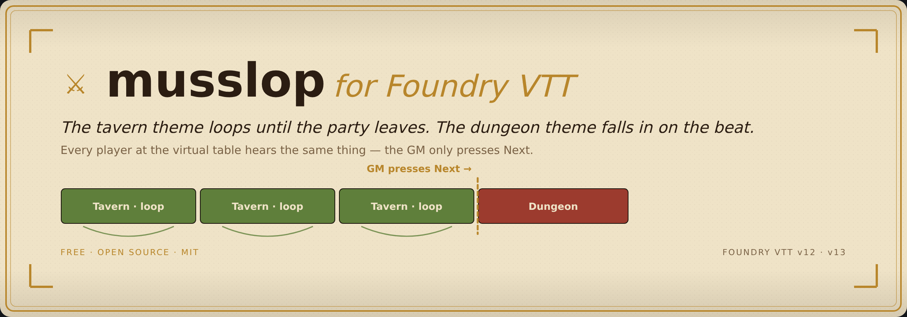
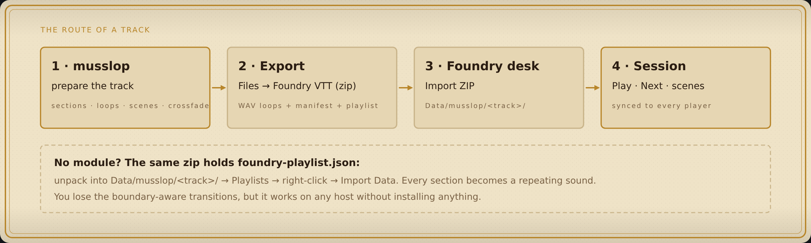
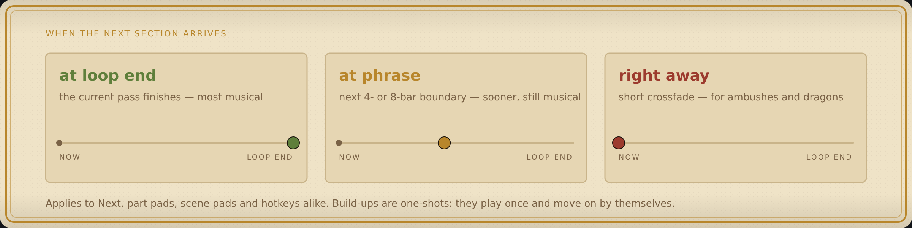
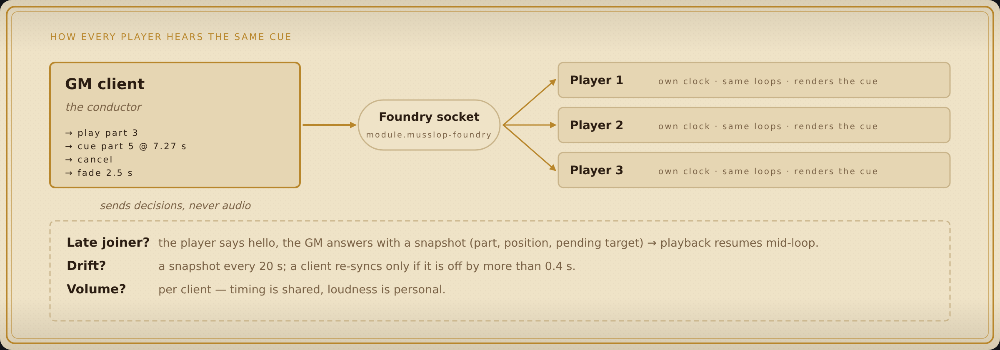

<p align="center">
  
</p>

<h3 align="center">Your soundtrack follows the party. Every player hears it.</h3>

<p align="center">
  <a href="https://foundryvtt.com/"></a>
  <a href="https://github.com/Siziff/musslop"></a>
  <a href="https://developer.mozilla.org/docs/Web/API/Web_Audio_API"></a>
  <a href="LICENSE"></a>
</p>

<p align="center">
  <b>Loop the tavern · cue the dungeon · land it on the beat · in sync for the whole table</b>
</p>

---

**musslop-foundry** plays tracks prepared in [musslop](https://github.com/Siziff/musslop) inside Foundry VTT
as game-style adaptive music. A section loops for as long as the scene needs. When the party opens
the door, the GM cues the next section and it arrives **on the loop or phrase boundary** — not mid-bar.
The GM's decisions go out over Foundry's socket; **every connected player hears the same transition**.

You still decide when the music moves on. The module doesn't listen to the game — it gives the GM a
good pair of hands.

<p align="center">
  
</p>

## What you get

| At the table | Under the hood |
|---|---|
| **Seamless loops** — the Inst section repeats for twenty minutes of haggling without a seam | every loop pass is its own `AudioBufferSourceNode` scheduled on Foundry's music `AudioContext` |
| **Cues that land on the music** — *at loop end · at phrase · right away* | phrase boundaries come from the musslop manifest (`transition_points_sec`) |
| **Scenes with hotkeys** — *Empty corridor · Something is close · Ambush · Aftermath* from one track | scenes are exported by musslop with their loop and cue mode; `Shift+Alt+1…9` |
| **One desk for the session** — tracks, now / next with ETA, pads, Next / Cancel / Fade out | ApplicationV2 window, GM-only controls, read-only view for players |
| **Everyone in sync** — late joiners drop in mid-loop | the GM broadcasts *decisions*, not audio; snapshots correct drift > 0.4 s |
| **Post-exit tails & one-shot build-ups** | `*_tail.wav` rings over the next section; `loop: false` parts play once |

<p align="center">
  
</p>

## Install

Foundry → **Add-on Modules → Install Module** → paste the manifest URL:

```
https://github.com/Siziff/musslop-foundry/releases/latest/download/module.json
```

Enable it in the world. The GM gets a **♪ music-note button** in the *Sounds* scene controls;
`Alt+M` toggles the desk from anywhere.

> Until the first GitHub release exists, clone this repo into `Data/modules/musslop-foundry/` and reload Foundry.

## From a track to the table

1. **In musslop** — load the track, check the loops (⟲♪ / →♪), save a few scenes, set the crossfade.
   Then **Files → ⤓ Foundry VTT (zip)**.
2. **In Foundry (GM)** — open the desk → **Import ZIP** → pick `*_foundry.zip`.
   Files are uploaded to `Data/musslop/<track>/`.
   *Hosted Foundry (The Forge, Molten…)*: unpack the zip and upload the folder to `musslop/<track>/` with the file browser instead, then press ↻ in the desk.
3. **Play.** Pick the track, press **Play**, and cue parts or scenes as the story moves.
   Players need no setup — the browser starts audio on their first click anywhere in Foundry, after that it follows the GM.

### No module on the host? Use the playlist

The same zip contains **`foundry-playlist.json`** (and `foundry-playlist-scenes.json`):
unpack into `Data/musslop/<track>/`, then *Playlists → right-click → Import Data*.
You get a regular Foundry playlist where every section is a repeating sound. Click one to loop it,
click another to switch — Foundry crossfades by the playlist *fade*. No boundary-aware transitions,
but it works everywhere and needs nothing installed.

## Keys (GM; change them in *Configure Controls*)

| Key | Action |
|---|---|
| `Alt+M` | open / close the desk (everyone) |
| `Alt+→` | **Next** — the following part, with the current transition mode |
| `Alt+Backspace` | cancel the queued transition — stay where you are |
| `Alt+F` | fade out over 2.5 s |
| `Shift+Alt+1…9` | scene with that hotkey |

## How the sync works

<p align="center">
  
</p>

The GM's client is the conductor. It sends small messages — `play part 3`, `cue part 5 at 7.27 s`,
`cancel`, `fade` — never audio. Each player's client holds the same decoded loops and schedules them
on its own `AudioContext`. A state snapshot (part, position inside the loop, pending target) is sent a
moment after *Play* and every 20 s; a client re-syncs only when it is off by more than 400 ms, so you
don't hear corrections. A player who joins late says *hello* and gets the snapshot back. Volume is per client.

## Macro API

```js
const m = game.modules.get("musslop-foundry").api;
await m.load("Tavern_Theme");      // slug = folder name under Data/musslop
m.play(0);                         // start looping part 0
m.cue(3, "soon");                  // natural | soon | now
m.scene("Ambush");                 // a scene by name (uses its own cue mode)
m.next(); m.cancel(); m.fade(2);   // transport
```

Handy for *Trigger Happy* / region behaviours: drop a macro on the dungeon door.

## Export format (for the curious)

`manifest.json` is musslop's loop manifest: `loops[]` with `file`, `duration_sec`, `loop`,
`loop_start_sample`, `downbeats_sec`, `transition_points_sec`, `tail_file`, `stinger`; `scenes[]` with
`loop_index`, `cue`, `hotkey`. The player (`scripts/loop-player.js`) has no Foundry dependencies and
runs in a bare page — that's how it is tested.

## Roadmap

- **Drop a track straight into Foundry** — analysis on the musslop server, upload from the desk (see [issue: level 3](https://github.com/Siziff/musslop-foundry/issues)).
- Region / scene triggers: cue a part when a token enters an area.
- Stems: per-layer volume for *calm → combat* on the same loop.

## Built with

[musslop](https://github.com/Siziff/musslop) · Foundry VTT API (ApplicationV2, sockets, keybindings, FilePicker) · Web Audio

**Free and open source (MIT).** No accounts, no telemetry, no paid tier. Made for my own table; shared because yours probably has the same problem with the boss music.
